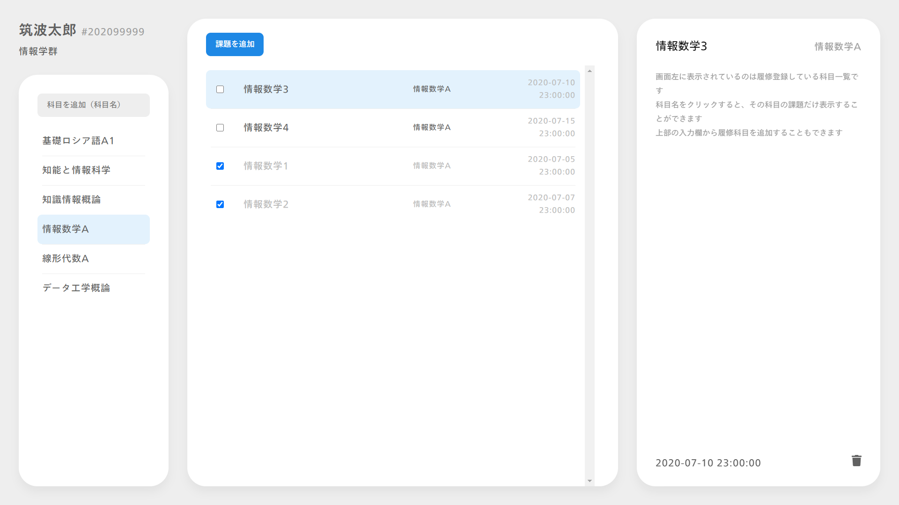

# dblecture-archive

2020年度開講[データ工学概論](https://kdb.tsukuba.ac.jp/syllabi/2020/GC13201/jpn/0/)の最終課題として制作したシステムです

フロントエンドは[別レポジトリ](https://github.com/mkobayashime/dblecture-app)でアーカイブとして残しています

## ディレクトリ・ファイル

|名前|説明|
---|---
|[**api**](./api)|PHP 製の簡易的な API バックエンドとして利用|
|[**app**](./app)|[フロントエンド](https://github.com/mkobayashime/dblecture-app)|
|[**mysql**](./mysql)|MySQL のダンプや CSV 化したデータなど|
|[**index.html**](./index.html)|システムの概要を表示するためのページ [turkey.slis.tsukuba.ac.jp/~hoge/](turkey.slis.tsukuba.ac.jp/~hoge/) に置けと指示されるもの|
|[**db**](./db)|各テーブル内のデータを表示するためのページ|
|[**style**](./style)|[index.html](./index.html) と [db](./db) の各ページに当てるスタイル|
|[**pptx**](./s2010127-f-Kobayashi-Masaki.pptx)|最終提出 pptx ファイル|